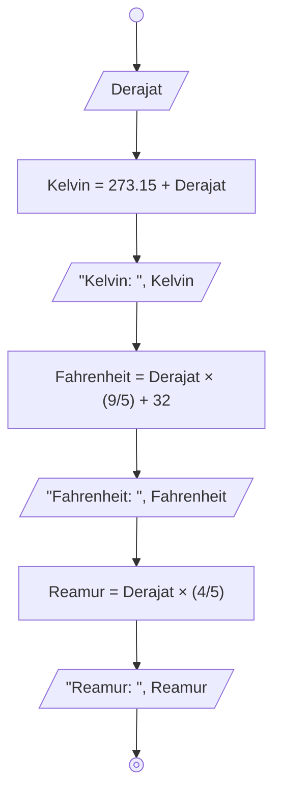

# Celcius-to-all Conversion Algorithm

## Flowchart

```mermaid
flowchart TD
    Start@{ shape: start }
    Input@{ shape: lean-r, label: "Derajat" }
    Kelvin@{ shape: rect, label: "Kelvin = 273.15 + Derajat" }
    OutputKelvin@{ shape: lean-r, label: "#quot;Kelvin: #quot;, Kelvin"}
    Fahrenheit@{ shape: rect, label: "Fahrenheit = Derajat × (9/5) + 32" }
    OutputFahrenheit@{ shape: lean-r, label: "#quot;Fahrenheit: #quot;, Fahrenheit"}
    Reamur@{ shape: rect, label: "Reamur = Derajat × (4/5)"}
    OutputReamur@{ shape: lean-r, label: "#quot;Reamur: #quot;, Reamur"}
    End@{ shape: stop }

    Start --> Input --> Kelvin --> OutputKelvin --> Fahrenheit --> OutputFahrenheit --> Reamur --> OutputReamur --> End
```
